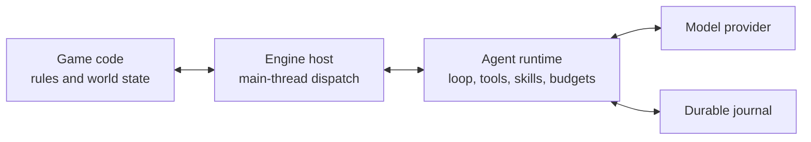

# Game Agent Runtime

An in-engine agent runtime for AI-native games.

Game Agent Runtime accepts typed game context, runs a streaming model/tool loop,
dispatches actions through the game engine, and persists enough state to recover
without blindly repeating side effects. Input can be text, JSON, numbers, event
payloads, or resource references.

> Status: `0.1.0-alpha.1`. The wire protocol and public APIs may still change
> before `1.0`.

## What it provides

- Durable multi-turn agent loops with streaming, retry, route-scoped fallback,
  bounded cross-run cooldown, single half-open probes, and stale-attempt
  fencing.
- Request-only long-conversation pruning and typed, audited derived compaction
  that preserve the authoritative transcript, semantic anchors, and unresolved
  tool state.
- Typed observations and structured tool results; natural language is optional.
- Explicit game-time, timeline, entity-incarnation, perspective, spatial,
  state-version, and causal coordinates.
- Bounded multi-actor decision batches with isolated failures, deterministic
  result ordering, aggregate hard-budget reservation, and host-visible
  simultaneous-action metadata.
- Optional provider workload quotas that reserve capacity for interactive play
  while background simulations and NPC batches remain bounded.
- Script-aware prompt budgeting, provider/model-owned token estimators, and
  bounded upward calibration from accounted input usage.
- Immutable tool and skill snapshots with bounded progressive disclosure.
- Build-time skill import diagnostics without online code installation.
- Strict tool argument validation and deterministic conflict-key resolution.
- Safe parallel reads, serialized writes, engine-main-thread affinity, and
  world/external side-effect barriers.
- Optional per-model-turn side-effect admission, with atomic write rejection
  and continued pure-read execution when a response exceeds the policy.
- Optional strict final-output admission with structured contracts, exact
  durable action evidence, provisional streaming, and fail-closed recovery.
- Cancel, interrupt, steer, and follow-up controls.
- Turn, token, duration, cost, and action budgets.
- Durable provider usage accounting across retries, with explicit incomplete
  accounting when cancellation prevents a final usage report.
- Provider capability profiles and request adapters for wire-only sanitation,
  tool-pair repair, and transport-specific limits.
- Native streaming adapters for OpenAI-compatible chat completions and
  Anthropic Messages, with provider-specific tool and usage semantics.
- Versioned provider dialects, exact-byte evidence for built-in prepared
  transports, stable-prefix cache diagnostics, and route-bound continuation
  state that is ephemeral unless both application and provider opt in.
- Append-only local journals, write-ahead action requests, crash recovery, and
  explicit reconciliation of uncertain operations.
- Exact derived-conversation checkpoints for safe pre-provider crash replay,
  plus bounded Stop and ownership-aware Dispose semantics. Runtime-owned calls
  fully drain; non-cooperative host tool callbacks stay quarantined and fenced.
- In-memory and crash-tolerant file-backed lexical memory with no embedding
  model requirement, atomic mixed-write batches, committed world/save
  provenance, multi-provider recall, prefetch, policy-driven in-loop context,
  and recoverable idempotent atomic writeback.
- Engine-neutral native world packages with closed JSON contracts, typed
  interactions, portable fixed-point numerics, named game clocks, fixed event
  evolution, durable schedules, exact state fences, and settled save/fork
  restore.
- Frame-friendly stream coalescing with bounded reconnect cursors, redacted
  JSONL trace export, journal projection, and scenario evaluation.
- Receipt-gated durable world presentations with typed localization and media
  cues, content-revision CAS, host-authorized incarnation-aware projections,
  privacy-safe paged export, and crash-tolerant local persistence.
- Durable settlement outboxes that project only terminal authoritative world
  evidence into private memories, group sessions, and presentation frames,
  plus deterministic settled-world bundles with privacy-aware import/export.
- Engine packages for Godot and Unity, with an Unreal compatibility module and
  protocol probe.

The runtime does not decide game legality or mutate world state itself. The game
owns business rules and returns an authoritative `ActionReceipt`.

Run requests and continuations are deep-snapshotted before the first asynchronous
wait. Callers can reuse or mutate their DTOs after `RunAsync` or `ResumeAsync`
returns a pending operation without changing the admitted run.

On resume, an omitted or empty `ActiveSkills` list inherits the latest durable
skill activation. A non-empty list replaces it; set `ReplaceActiveSkills = true`
with an empty list to clear every active skill explicitly.

## Runtime boundary



The agent loop runs locally in the game process. Model inference may be local or
remote. A shipped consumer game should not embed a permanent provider key; use a
server relay or short-lived scoped credential. Developer BYOK workflows can keep
credentials in platform-protected local storage.

## Quick start

The protocol, core, persistence, provider, and composition libraries target
`netstandard2.1`. Windows is the primary release/package target and the real
Godot engine-test target. Linux builds and tests the complete portable .NET
solution and the portable Unreal wire/ABI boundary. Unity Editor/Player and
Unreal Build Tool/Editor validation remain separate compatibility gates. macOS
is not in the supported or CI matrix.

```csharp
var journalPath = Path.Combine(
    Environment.GetFolderPath(Environment.SpecialFolder.LocalApplicationData),
    "YourGame",
    "agent-runtime.journal");
await using var built = new GameAgentRuntimeBuilder(gameHost)
    .UseFileJournal(journalPath)
    .UseOpenAiCompatibleProvider(
        new OpenAiCompatibleProviderOptions
        {
            BaseUri = new Uri("https://api.deepseek.com"),
            Model = "deepseek-v4-pro"
        },
        new StaticBearerTokenSource(apiKey))
    .WithTools(toolDescriptors)
    .WithSkills(skillManifests)
    .Build();

DurableRunOutcome outcome = await built.Runtime.RunAsync(request, cancellationToken);
```

See:

- [Getting started](docs/getting-started.md)
- [Architecture](docs/architecture.md)
- [Game semantics and multi-actor coordination](docs/game-semantics.md)
- [Durable agent-driven world evolution](docs/agent-world-evolution.md)
- [Durable game-time schedules](docs/game-time-schedules.md)
- [Group interactions](docs/group-interactions.md)
- [Durable world presentations](docs/durable-presentations.md)
- [Durable world settlements](docs/world-settlements.md)
- [Durable workflows](docs/durable-workflows.md)
- [Interactive world framework](docs/interactive-world-v1.md)
- [Settled interactive world bundles](docs/interactive-world-bundles.md)
- [Protocol](docs/protocol.md)
- [Tools, skills, and memory](docs/tools-skills-memory.md)
- [Final-output admission](docs/final-output-admission.md)
- [Runtime metrics](docs/metrics.md)
- [Security](SECURITY.md)
- [Compatibility](docs/compatibility.md)
- [Imported character and lore activation](docs/imported-content-activation.md)
- [Godot package](engines/godot/README.md)
- [Unity package](engines/unity/README.md)
- [Unreal module](engines/unreal/README.md)

## Verify

```powershell
dotnet restore GameAgentRuntime.sln
dotnet test GameAgentRuntime.sln -c Release --no-restore
dotnet run --project tests/GameAgent.PerformanceSmoke -c Release --no-restore
dotnet format GameAgentRuntime.sln --verify-no-changes --no-restore
```

The live provider smoke test is opt-in and never prints model content:

```powershell
$env:DEEPSEEK_API_KEY = "<developer credential>"
dotnet run --project tests/GameAgent.LiveSmoke -c Release
Remove-Item Env:DEEPSEEK_API_KEY
```

## License

Apache-2.0. See [LICENSE](LICENSE).
