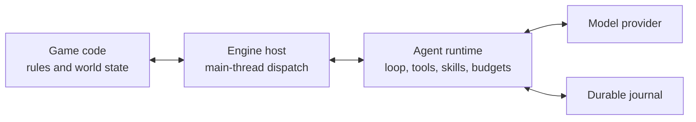

# Game Agent Runtime

An in-engine agent runtime for AI-native games.

Game Agent Runtime accepts typed game context, runs a streaming model/tool loop,
dispatches actions through the game engine, and persists enough state to recover
without blindly repeating side effects. Input can be text, JSON, numbers, event
payloads, or resource references.

> Status: `0.1.0-alpha.1`. The wire protocol and public APIs may still change
> before `1.0`.

## What it provides

- Durable multi-turn agent loops with streaming, retry, provider fallback, and
  stale-attempt fencing.
- Typed observations and structured tool results; natural language is optional.
- Immutable tool and skill snapshots with bounded progressive disclosure.
- Strict tool argument validation and deterministic conflict-key resolution.
- Safe parallel reads, serialized writes, engine-main-thread affinity, and
  world/external side-effect barriers.
- Cancel, interrupt, steer, and follow-up controls.
- Turn, token, duration, cost, and action budgets.
- Durable provider usage accounting across retries, with explicit incomplete
  accounting when cancellation prevents a final usage report.
- Append-only local journals, write-ahead action requests, crash recovery, and
  explicit reconciliation of uncertain operations.
- A local lexical memory baseline with no embedding model requirement, plus
  interfaces for custom retrieval systems.
- Engine packages for Godot and Unity, with an Unreal compatibility module and
  protocol probe.

The runtime does not decide game legality or mutate world state itself. The game
owns business rules and returns an authoritative `ActionReceipt`.

Run requests and continuations are deep-snapshotted before the first asynchronous
wait. Callers can reuse or mutate their DTOs after `RunAsync` or `ResumeAsync`
returns a pending operation without changing the admitted run.

On resume, an omitted or empty `ActiveSkills` list inherits the latest durable
skill activation. A non-empty list replaces it; set `ReplaceActiveSkills = true`
with an empty list to clear every active skill explicitly.

## Runtime boundary



The agent loop runs locally in the game process. Model inference may be local or
remote. A shipped consumer game should not embed a permanent provider key; use a
server relay or short-lived scoped credential. Developer BYOK workflows can keep
credentials in platform-protected local storage.

## Quick start

The protocol, core, persistence, provider, and composition libraries target
`netstandard2.1`. The repository build and tests use the .NET 8 SDK.

```csharp
var journalPath = Path.Combine(
    Environment.GetFolderPath(Environment.SpecialFolder.LocalApplicationData),
    "YourGame",
    "agent-runtime.journal");
await using var built = new GameAgentRuntimeBuilder(gameHost)
    .UseFileJournal(journalPath)
    .UseOpenAiCompatibleProvider(
        new OpenAiCompatibleProviderOptions
        {
            BaseUri = new Uri("https://api.deepseek.com"),
            Model = "deepseek-v4-pro"
        },
        new StaticBearerTokenSource(apiKey))
    .WithTools(toolDescriptors)
    .WithSkills(skillManifests)
    .Build();

DurableRunOutcome outcome = await built.Runtime.RunAsync(request, cancellationToken);
```

See:

- [Getting started](docs/getting-started.md)
- [Architecture](docs/architecture.md)
- [Protocol](docs/protocol.md)
- [Tools, skills, and memory](docs/tools-skills-memory.md)
- [Security](SECURITY.md)
- [Compatibility](docs/compatibility.md)
- [Godot package](engines/godot/README.md)
- [Unity package](engines/unity/README.md)
- [Unreal module](engines/unreal/README.md)

## Verify

```powershell
dotnet restore GameAgentRuntime.sln
dotnet test GameAgentRuntime.sln -c Release --no-restore
dotnet format GameAgentRuntime.sln --verify-no-changes --no-restore
```

The live provider smoke test is opt-in and never prints model content:

```powershell
$env:DEEPSEEK_API_KEY = "<developer credential>"
dotnet run --project tests/GameAgent.LiveSmoke -c Release
Remove-Item Env:DEEPSEEK_API_KEY
```

## License

Apache-2.0. See [LICENSE](LICENSE).
