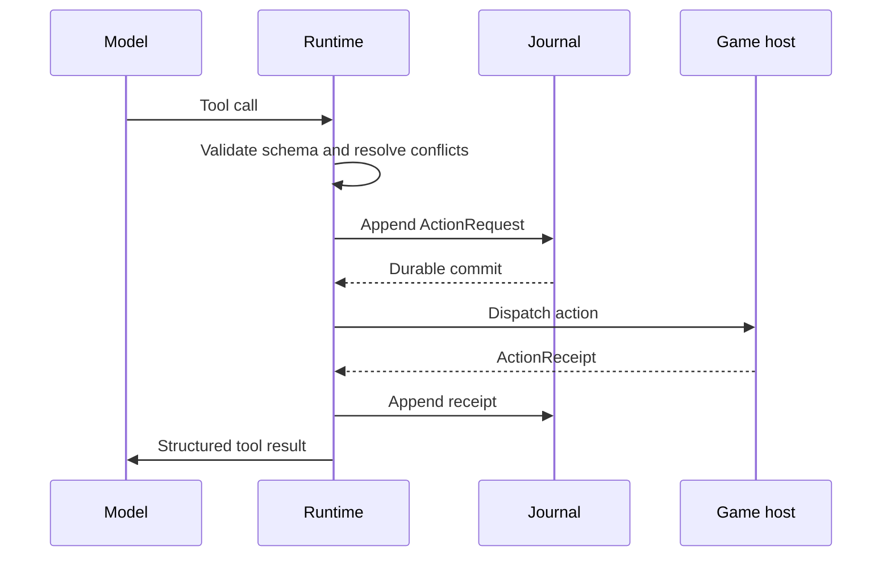

# Architecture

OpenGameAgent separates reusable agent mechanics from engine integration
and game-specific rules.

## Layers

### Game layer

The game owns world state, permissions, simulation rules, action legality, and
the final mutation. It exposes typed observations and action handlers. A handler
returns an authoritative `ActionReceipt` with one of:

- `succeeded`
- `rejected`
- `failed`
- `unknown`

The runtime never invents a successful world mutation.

### Engine host

The host translates engine data to the wire protocol, runs handlers on the
required thread, pumps runtime events without blocking frames, and coordinates
scene/application shutdown. Godot and Unity hosts share the C# core but keep
engine types out of it.

### Runtime core

The core owns:

- run and turn lifecycle;
- stateless completion and durable direct/agent/workflow routing;
- normalized provider messages;
- provider retries and stale-stream fences;
- tool and skill snapshots;
- context compilation plus a replaceable bounded context engine;
- memory interfaces, bounded query/reranking stages, a bounded in-memory store,
  and a crash-tolerant file-backed store;
- persistent Agent identities, graph edges, mailboxes, bounded residency, and
  cited memory distillation;
- game-time trigger admission, external attention, session-bound context
  deltas, and hierarchical durable budgets;
- tool scheduling;
- budgets and bounded queues;
- control commands;
- typed lifecycle middleware and bounded child Agent supervision;
- journaling, operation ledgers, and recovery.

Optional engine-neutral modules add durable workflows, strictly admitted
model-authored command plans, and provider-neutral media/structured-content
jobs. Generated content reaches the game only through a host-owned
stage/validate/commit transaction. These modules do not move game authority or
model hosting into the runtime.

The core targets `netstandard2.1` and does not reference an engine SDK.

The execution surfaces are deliberately distinct. Stateless completion avoids
session and journal overhead for isolated model calls. Durable direct execution
keeps context, memory, accounting, and recovery but performs one tool-free model
turn. Agent execution owns the bounded tool loop. Workflow execution owns a
fixed recoverable graph around Agent steps. The default hybrid router classifies
obvious dialogue locally, escalates actionable, structured, long, or ambiguous
input, and consults an optional classifier only for ambiguous text. Routing
therefore optimizes latency without adding a classification call to every
request or allowing a cheap path to silently omit required capabilities.

Game-semantic coordinates remain engine-neutral. Named clocks, timelines,
save/state revisions, entity incarnations, observer perspective, spatial scope,
and causal parents can travel with a run without becoming runtime-owned game
rules. `MultiActorDecisionCoordinator` bounds many actor runs against one
immutable coordinate and propagates their batch and decision identities to the
host. The host still owns simultaneous-action resolution. See
[Game semantics](game-semantics.md).

## Workload admission

The core has a final in-process workload boundary even when it is used without
an engine adapter. Limits belong to a registry or runtime instance; applications
that create multiple runtimes can share a registry when they need one common
boundary. `RunOwnershipRegistry` defaults to at most 256 admitted runs, 256 live
ownership lanes, and 64 queued waiters per lane. Waiting runs count toward the
active-run limit. Admission checks are atomic: an already active run ID reports
`duplicate_run`, while workload exhaustion uses the separate `max_active_runs`,
`max_lanes`, or `max_waiters_per_lane` reason code.

`GetDiagnostics()` returns only active, waiting, and lane counts plus immutable
limits. It never returns run or lane identifiers. The lane semaphore provides
mutual exclusion, but the API does not promise FIFO scheduling or starvation
freedom.

Provider admission has a separate optional class quota. Set
`MaxConcurrentBackgroundProviderCalls` below `MaxConcurrentProviderCalls` and
mark simulation work as `background` to reserve the remaining calls for
`interactive` runs. The class is captured with the durable run input and reused
on recovery. This is a capacity guarantee, not a promise of FIFO ordering and
not a game-importance policy.

Engine adapters should normally configure lower limits that match their frame,
memory, and platform budgets. Those adapter limits protect the engine-facing
queue; the core limits remain a last line of defense for direct use and
misconfigured hosts. The compact `HeadlessAgentRuntime` independently defaults
to 256 concurrent runs and 256 total in-flight host actions, including actions
whose handlers ignored cancellation and returned late. It accepts lower
`HeadlessAgentRuntimeLimits` values. Its direct input boundary also defaults to
512 observations, 512 tools, one MiB of aggregate encoded input, and bounded
JSON depth, node, string, and container sizes.

Callbacks that can enter application code are isolated by process-wide
boundaries as well as per-runtime queues. Data-plane, lifecycle, execution
policy, conversation-context, and memory-extension cancellation callbacks use
independent bounded admission lanes. Control-plane, data-plane, execution-policy,
agent-lifecycle, conversation-context, memory-extension, and skill-content
cancellation each has its own fixed process-wide worker class with two dedicated
workers and a bounded queue. Buffered event observers have their own worker
boundary. A blocking extension therefore cannot starve ordinary task
continuations, shutdown, or another extension domain. A permanently blocking
callback retains one worker and one lane reservation until it returns; once its
worker class or lane is full, later cancellation attempts fail safely while the
owning operation remains detached and bounded by its normal shutdown policy.
This isolates resource growth but does not attempt to terminate uncooperative
application code.
Root lifecycle shutdown is stricter: if its cancellation lane is temporarily
full, shutdown remains pending and dispatches cancellation when capacity
returns. It never reports an unissued root cancellation as completed.

Starting an application callback has a separate process-wide boundary. The
synchronous prefix of provider streaming/preparation, memory search/embedding,
routing policy, context, middleware, skill-resolution, multi-actor lifecycle,
and final-output admission policy callbacks run outside the ordinary .NET
worker pool. At most 64
such prefixes can be active across the process. At most 256 accepted callbacks
may remain outstanding while awaiting asynchronous completion or required
cleanup admission, and each callback domain also has bounded admission. The
prefixes run on a lazily grown, reusable dedicated worker pool rather than
creating an operating-system thread for every streamed event. The
initial prefix lease includes callback invocation and asynchronous-wait
registration. A custom `ValueTask` source is also re-admitted before its
extension-controlled completion result is read. The normal per-runtime slot
remains held until the asynchronous operation settles, but ordinary
asynchronous waiting does not retain a prefix thread or active-prefix lease.
A synchronously blocked extension therefore cannot delay wall-clock timeout
continuations or evade the bound through a custom awaitable. Saturation fails
or falls back through the owning subsystem's existing capacity/error contract
instead of creating an unbounded thread or queue. An already accepted callback
may still settle or clean up after its caller times out, but it remains inside
the 256-callback outstanding bound. Exhausting that budget is an explicit
capacity failure; it cannot create another waiter.

`DurableAgentRuntime.StopAsync` is intentionally bounded. It reports whether
active runs and detached work drained within their configured windows, while
already-started cleanup continues. `DisposeAsync` and
`WaitForShutdownDrainAsync` provide the ownership boundary: they wait for the
last active run, provider cleanup, conversation cleanup, and root cancellation
callbacks before an owner may dispose the journal or provider transport. They
also wait for the bounded cancellation/isolation phase of skill-content
resolution, but do not claim that a resolver which ignored cancellation has
exited. `DetachedSkillContentResolverCallCount` is the live census and
`SkillContentResolversDrainedOnStop` records the bounded drain result.
Strict final-output policy evaluation follows the same ownership rule:
`FinalOutputAdmissionPolicyCallsDrainedOnStop` records the bounded result and
`DetachedFinalOutputAdmissionPolicyCallCount` remains a live census after a
policy ignores cancellation. Completed runtime cleanup does not claim those
application callbacks have returned.
`BuiltGameAgentRuntime` uses that runtime-owned drain path and publishes one
shared shutdown task before any user callback can re-enter shutdown.
Non-cooperative host tool callbacks are different: the runtime waits only for
their configured bounded interval, then keeps them quarantined and fences late
runtime mutation. Application dependencies captured directly by such a
callback remain host-owned until it returns.

## Durable action boundary

If dispatch may have happened but no authoritative receipt is available, the
runtime records `unknown` and enters `reconciling`. Recovery queries the game by
`operationId`; it does not replay the action. Reconciliation queries are
single-flight per world, run, and operation across runtime instances, with a
process-wide capacity of 64. If a reconciler ignores cancellation, its identity
and capacity lease remain reserved until the query really completes. Another
resume preserves the pending operation instead of starting a duplicate query.

Every durable store implements `AppendAtomicBatchAsync`. A set of model tool
calls is committed as one batch before any action is admitted to the host, and
receipt/lifecycle pairs use the same primitive. Custom stores must make the
whole batch visible or none of it; wrappers must forward this capability rather
than decomposing it into individual appends.

Run initialization uses the same atomic primitive. `run.started`, the optional
initial context/active-skill input snapshot, every initial transcript message,
and the first `run.checkpoint` enter the journal as one ordered batch. The input
snapshot is a recovery bridge only until the first turn snapshot commits; it
prevents a process loss between run initialization and turn preparation from
silently dropping required input. Recovery therefore sees either the complete
initial input in `running` state or no new run. A legacy or non-conforming
journal left in `preparing` is failed closed because recovery cannot infer which
initial messages are missing.

Each pre-provider turn boundary is atomic too. `turn.started`, any replacement
skill disclosure, compiled context message, deferred-tool activation change,
and `turn.snapshot` commit as one ordered batch. No conforming store can expose
a started turn while hiding the prompt inputs or tool state needed to retry it.

A successful model `runtime_tool_activate` result and its complete exact
activation state use a separate two-event atomic batch. Recovery therefore sees
both or neither. The activation changes only the next provider turn; every game
tool call in the response that requested activation is checked against the
fixed effective schema captured before that provider call.

A successful model `runtime_skill_activate` uses an exact
skill-id/version/content-digest identity. Its run checkpoint, any required
deferred-tool disclosure change, and activation result transcript commit as one
ordered batch. The checkpoint lifecycle accepts only this reason-coded
progression, requires exactly one new identity, and forbids mutation or removal
of prior identities. Initial exact state is bound before `run.started`, so
ordinary turn events never change immutable run extensions.

If a process stops after `turn.started` but before a usable provider result, the
runtime reopens the turn only with journal proof that replay is safe: either no
provider dispatch exists for that turn, or every dispatch ended in an explicit
known-zero checkpoint. It writes a `turn.completed` abandonment checkpoint,
clears `currentTurnId`, refunds that turn count, and then starts a fresh turn.
The abandonment reason also makes a second crash idempotent. Charged,
uncertain, committed, or discarded provider attempts are never refunded by this
path. Prompt inputs already committed for the safe turn remain durable: selected
context is retained in the transcript, and activated skill references are
recovered from the durable disclosure when the continuation does not override
them. Only assistant/tool output from an abandoned turn is treated as orphaned.
The same disclosure inheritance applies at a clean turn boundary. A continuation
with a non-empty `ActiveSkills` collection replaces the recovered activation.
To deliberately clear all active skills, the caller supplies an empty collection
with `ReplaceActiveSkills = true`.

## Turn snapshots

Each turn captures one immutable tool snapshot and one immutable skill snapshot.
Hot updates become visible on the next turn. A durable `TurnSnapshot` records
generations and digests so a trace can explain exactly what the model saw.
Skill admission is evaluated against those captured snapshots before prompt
disclosure. The snapshot extension records the admission policy identity,
version, decision-set digest, and admitted active-skill content digests. It
also records the complete context budget report and prompt byte/token estimate,
including turns where every optional context item was deferred or pruned.
The tool-disclosure extension separately identifies base direct tools, exact
active deferred tools, runtime control tools, the effective provider-schema
digest, the current authorized-hidden-only digest, and policy decision/reason
digests. Internal and denied descriptors do not contribute to the hidden
catalog digest.
Strict runs also bind the final-output policy identity, bounded-options digest,
and optional structured output contract. Provider text remains provisional
until the runtime-local submission tool is admitted against exact current-run
terminal receipt evidence. See
[Final-output admission](final-output-admission.md).
The runtime also deep-snapshots each admitted run request or continuation before
its first asynchronous wait, so caller-owned mutable DTOs cannot change a queued
run's identity, budget, transcript, context, or active skills.

Before each provider request, `ConversationContextManager` derives a bounded
view from that durable transcript. System material, the stable skill prefix,
the latest user message, a configured recent tail, unresolved calls, and
call/result groups are protected. Compaction has a deadline and per-run failure
cooldown. The same deadline covers concurrency-slot admission and execution.
The compactor SPI returns only bounded summary text, the exact source-message
IDs it used, and the source digest. The runtime verifies those IDs against the
compaction input and creates a fixed `historical-data` JSON envelope with a
runtime-owned message ID, `user` role, content type, source count, and one JSON
part. A custom or model-backed compactor therefore cannot inject assistant,
system, reasoning, tool-call, or tool-result protocol structure.
The default summary text is itself a versioned JSON contract. Typed items
separate the latest pending ask, explicit constraints, unfinished intents or
commitments, exact identifiers, and representative excerpts. Its audit records
the number of messages scanned, detected and preserved item counts, omitted
source-message count, exact source/envelope UTF-8 bytes, reclaimed bytes, and
reclaim ratio. Self-referential envelope/reclaim metrics use canonical signed,
zero-padded decimal strings, keeping their encoded width stable while
reporting the exact final envelope size. The analyzer scans the complete
admitted compaction source and requires evenly spaced coverage points
(including middle points for sources larger than 128 messages), so head/tail
excerpt limits cannot make the middle of a long source wholly unauditable.

The runtime independently derives required semantic anchors from the immutable
admitted source; it does not trust a compactor's declared audit. A returned
summary is rejected when lineage is invalid, required anchors or coverage are
missing, the envelope makes no byte progress, or it reclaims less than both
128 bytes and ten percent of its source. A rejected custom result is replaced
by the deterministic extractive contract within the same absolute deadline and
global concurrency slot. If even that contract cannot preserve the required
anchors while making useful progress, preparation fails closed to bounded
deterministic pruning and the normal per-run failure cooldown applies.
Calls also share a global concurrency limit. A timed-out
non-cooperative compactor remains tracked and keeps its slot until it exits;
runtime shutdown cancels and drains tracked calls for a bounded interval. A
host can inspect the nullable
`DetachedConversationCompactionsDrainedOnStop` result after shutdown. A
`false` value means the public bounded wait expired; the already-started
cleanup continues to observe the compactor and releases its capacity and
resources when the callback actually settles. A shutdown-capacity rejection
does not close the manager, so shutdown can be retried without leaving an
unusable half-closed instance. A
failed compactor falls back to deterministic pruning; it never rewrites the
journal or proves that a game action happened. The turn snapshot stores
source/view digests and compaction evidence.

The same snapshot also carries a bounded
`conversationContextCheckpoint`. It identifies the exact ordered provider view
by message ID and, only when compaction occurred, includes the runtime-created
summary plus verified source lineage. It does not duplicate retained transcript
bodies. Recovery reuses the checkpoint only when the run and complete admitted
transcript digest still match, and consumes each registration after one
attempt. Missing, stale, over-capacity, or invalid checkpoint evidence degrades
to normal deterministic preparation instead of changing durable transcript
history.

## Provider attempts and usage

A provider attempt can be retried only when its cleanup completed and either the
provider proved that no usage occurred or a usage event was durably charged.
Before provider code can dispatch a request, the runtime appends a durable
`provider.dispatch_started` checkpoint containing the provider, model, transport
dialect, capability digest, route digest, provider-attempt, and stream-attempt
identities. Reported usage settles billing for that identity, while the response
remains open until an atomic assistant-transcript plus
`provider.result_committed` batch succeeds or a
`provider.result_discarded` checkpoint records that the response will not be
used. Explicit known-zero and uncertain-usage records also close a dispatch.
Recovery treats a dispatch with unknown usage as a billing failure and a billed
dispatch with no durable response result as a response-recovery failure. Neither
path starts another provider request.

Provider failures have three explicit dispositions:
`AbortRun`, `Failover`, and `RetryThenFailover`. Request-wide validation,
policy, and unknown-usage failures abort immediately. Route-local failures such
as rejected credentials, exhausted account balance, or a missing configured
endpoint skip meaningless same-route retries and move to the next compatible
route. Transient failures may retry the same route first. A fallback remains
permitted only when the request was never dispatched, usage is explicitly known
to be zero, or reported usage has already been settled. The disposition never
overrides uncertain-usage or incomplete-cleanup fail-closed behavior.

Each runner maintains a thread-safe, bounded health table keyed by the stable
route digest. When a route-local failure exhausts that route, later runs and
resumes handled by the same runner skip it during an exponential cooldown.
After cooldown, exactly one run receives a half-open probe; concurrent runs
continue down the fallback chain. A successful probe closes the route, while a
failed probe reopens it with a bounded longer cooldown. The table is
process-local availability state rather than durable game state, so creating a
new runner starts with an empty table. Configure it with
`ProviderRouteResilienceOptions` or
`GameAgentRuntimeBuilder.WithProviderRouteResilience(...)`.

One immutable provider route plan is captured before `turn.snapshot` and is
passed unchanged to dispatch. The snapshot and cache key therefore describe the
planned primary route, while each dispatch/result records the route that was
actually attempted after retry or fallback. A later mutation of a provider's
live capability object cannot make the journal describe one route and dispatch
another.

Prompt budgeting uses `IRuntimeTokenEstimator`. The default builder installs a
script-aware conservative estimator that treats CJK scalars, emoji, JSON
punctuation, ASCII word runs, and whitespace separately instead of assuming one
global byte ratio. The context-budget and prompt-measurement evidence record
the estimator identity and version.

Each provider route may additionally implement
`IProviderPromptTokenEstimator`. That route-owned estimate replaces the generic
estimate only for its own context-window and output-cap gate; a fallback model
can therefore use a different tokenizer. Invalid or throwing estimators fail
over before dispatch. `ICalibratingProviderPromptTokenEstimator` receives only
accounted input usage after a completed attempt. The bundled estimator raises a
bounded safety multiplier when actual usage exceeds its estimate and never
calibrates downward. Its identity and version are part of the bundled
provider's route-policy digest.

Provider prompts place the current durable skill-system disclosure before
turn-specific transcript messages. The turn snapshot records a semantic digest
of that leading stable prefix separately from the complete dynamic prompt
digest. Message IDs and timestamps do not perturb the stable digest because the
provider wire format does not send them.

`providerCacheKey` records stable-prefix, tool, skill, planned-route, memory,
compaction, and dynamic-request digests. `providerCacheDecision` distinguishes
true stable-prefix breaks from dynamic-tail changes. Provider usage events add
`providerCacheUsage` with `hit`, `write`, `miss`, `no_activity`, or `unknown`;
missing cache counters remain `unknown` and are never interpreted as zeros.

The selected transport then gets its own request snapshot. An optional provider
adapter can remove unsupported reasoning and repair wire-level tool pairing.
Protected identities, the authorized tool set, and token caps are revalidated
after adaptation. The runtime also recomputes the final message count and
digest, rejecting stale adapter evidence before dispatch. Provider capability
and route digests include the transport limits used for the attempt. Adapter
invocation is isolated from the caller and bounded by
`RequestPreparationTimeout`. A non-cooperative adapter is cancelled through the
bounded cancellation dispatcher, quarantines that provider until it actually
settles, and is exposed through the same detached-cleanup callback used by
provider streams.

Routes may expose a typed, versioned `ProviderDialectContract` covering request
family/schema, stream framing, tool-call, usage, reasoning, content type, and
optional continuation-state semantics. Prepared built-in transports hash the
exact private byte buffer they send and journal only its digest, length, and
content type. Recovery binds that evidence to the typed dialect and route.
Third-party prepared providers supply their own evidence; the core validates
its structure and bindings but cannot independently prove bytes that remain
inside third-party code.

A provider may also return bounded opaque continuation state. It is route- and
dialect-version-bound, remains process-local by default, and a completed
response with no update clears the previous value. Durable storage is disabled
by default. It requires both
`AllowProviderDeclaredNonSecretContinuationPersistence = true` and the
provider's explicit `DurableNonSecret` declaration; terminal output never
persists another continuation. Recovery rejects mismatched provider, route, or
state-version envelopes.

After a response has been obtained, the runtime performs one final
control/deadline check and then durably adopts or discards that response with a
non-cancellable settlement. If response completion races with steer, interrupt,
cancel, or the deadline, charged usage is recorded first and a matching
`provider.result_discarded` event closes the same provider/attempt/stream
identity before the control outcome is applied.

Usage from failed attempts counts toward the same run budget, and later attempt
output caps shrink by the tokens already consumed. If a dispatched attempt ends
without a trustworthy usage event, the runtime does not retry or fall back
silently. It sets `AgentUsage.hasUnaccountedUsage`, increments
`unaccountedProviderAttempts`, and appends a durable
`provider.usage_uncertain` checkpoint. The known token and cost totals remain
lower bounds until application billing data reconciles the missing attempt. The
event carries the provider, provider-attempt, stream-attempt, and reason
identifiers as structured fields. Recovery never starts another provider request
from a non-terminal run with unaccounted usage: it first fails the run closed, or
waits for pending game-operation reconciliation and then fails it closed. The
application must reconcile billing separately and start a new run.

## Live event observers

The live event stream covers durable lifecycle notifications and bounded
ephemeral provider/tool progress. `assistant.delta` payloads distinguish text,
tool-call argument/name deltas, usage, and completion with the provider stream
identity that produced them. Raw reasoning deltas are deliberately not
published to the general runtime observer. A host that implements
`IProgressReportingGameHost` receives an execution-scoped
`IGameActionProgressSink`; its bounded `tool.progress` reports include the
operation, tool call, action, stage, optional counters, and optional structured
data. Reports are presentation evidence only, may be dropped under pressure,
and never replace the authoritative `ActionReceipt`. Each action accepts at
most 10,000 reports. A retained sink closes when that host invocation finishes,
so excess and late reports are ignored.

Durable events remain authoritative in the journal when a live observer fails.
`BufferedRuntimeEventPublisher` protects the runtime from a synchronous
observer: its queue is bounded and its process-wide observer-worker pool is
independent from run and shutdown cancellation. `WorkerRejections`,
`DroppedEphemeralEvents`, `DroppedDurableNotifications`, and
`PublisherFailures` distinguish live-notification loss from durable state.
Disposing a publisher clears queued notifications but does not pretend that a
currently blocked observer has stopped; that worker lease is released only
when the observer returns.

`StreamingTextCoalescer` combines token-sized deltas for one provider stream by
UTF-8 size, idle interval, or paragraph boundary. Application code that enables
provider retry or fallback must put it behind
`AttemptSafeStreamingPresentationCoordinator`; a single coalescer must never be
reused across attempts.

The attempt-safe coordinator is the engine-facing presentation boundary. Every
chunk carries run, turn, provider-attempt, and stream-attempt identity. Starting
an attempt emits a reset, and the first text chunk also has
`ReplacesPriorText=true`. A retry or fallback lifecycle notice names the
abandoned provider and stream attempts and produces an explicit `superseded`
chunk before the replacement stream can be presented. Deltas arriving late
from an abandoned attempt are ignored. Consumers clear the run/turn view when
`ReplacesPriorText` is true and then append `Text`, so partial output from two
attempts is never concatenated.

Wire `BeginAttempt` from provider dispatch, `Push` from matching text deltas,
`ApplyLifecycle` from retry/fallback notices, and `Complete` from the accepted
provider result. `ApplyDiscard` handles an explicitly discarded result.

The per-attempt coalescer retains only a bounded prefix of already emitted
text. If that evidence overflows, finalization emits one authoritative
replacement chunk instead of retaining an unbounded transcript merely to
calculate a suffix.
The attempt-safe coordinator retains a separate bounded tail per run/turn and a
bounded number of tracked turns. A turn waiting between an abandoned attempt
and its replacement is never evicted for capacity. If a turn terminates without
final text, call `CloseTurn` to supersede any remaining partial text and make
that terminal turn evictable. A reconnecting UI
passes its next expected sequence to `ReplayFrom`, pages forward with
`ContinuationSequence`, and receives an explicit `CursorExpired` or
`CursorAhead` result instead of silently skipping or duplicating text. This
replay window is process-local presentation state; after process recovery,
consumers rebuild from durable run output rather than expecting token deltas to
be journaled. The coordinator does not own a producer queue: calls return a
bounded chunk list synchronously, while a slow consumer either catches up from
the bounded replay tail or receives `CursorExpired` and rebuilds from
authoritative state.

`RuntimeTraceExporter` produces bounded, redacted JSONL without credential-like
field names or values, bearer values, key prefixes, URL user information, or
sensitive URL query parameters. Redacted field names receive deterministic
collision-safe placeholders, so an attacker-controlled JSON key cannot
overwrite another exported field.
`RuntimeJournalProjector` and `RuntimeScenarioEvaluator` build deterministic
run summaries and assertions from the durable event sequence. All trace
analysis APIs share the same bounded, single-enumeration materialization path,
including finite event, per-event JSON, and aggregate UTF-8 limits.

`RuntimeTraceAnalyzer` projects a typed trajectory without retaining message
text: turns, message content digests, tool calls and results, host action
requests and receipts, provider route attempts, and usage/cost are correlated
by their recorded IDs. Stable assertion codes cover journal lifecycle, stable
run and generation identity, active-turn ordering, host receipt admission,
provider route-policy identity, revision, usage, and budget invariants. The
trajectory digest includes recorded event IDs and timestamps, so repeated
analysis of the same journal is byte-for-byte deterministic.

`RuntimeInspector` is the read-only developer surface over this machinery. It
always analyzes the complete durable run, while bounded sequence/kind filters
control only the cloned events returned to a caller. `ExportAsync` first checks
the complete journal and then uses the same bounded redacted JSONL exporter and
integrity digest. `BuiltGameAgentRuntime.Inspector` exposes it without granting
write access to the store. Ephemeral provider and tool progress is intentionally
live-only; inspect the corresponding durable requests, receipts, usage, and
terminal decisions after a restart.

`RecordedRuntimeReplayHarness` replays only immutable provider, host-action,
clock, and identity records. It never invokes a provider, calls the engine
host, reads a live clock, or generates an ID. `RuntimeScenarioBatchRunner`
accepts a bounded closed-world `game-agent.scenario.v1` JSONL format, evaluates
each trace once, and emits deterministic per-scenario results plus an aggregate
line. Programmatic and JSONL batches share aggregate event and materialized
trace-byte budgets in addition to their per-scenario limits, bounding retained
analysis state across the whole batch. These APIs use generated protocol
serializers and manual JSON writers, so they remain safe when reflection-based
JSON serialization is disabled. Aggregate cost output reports an explicit
`available`, `unavailable`, or `invalid` state and never silently drops a cost
that could not be attributed.

Each scenario line has `schema`, a unique `scenarioId`, an `events` array of
protocol `RuntimeEvent` objects, and an optional `expectation` object.
Expectations can constrain terminal/event kinds, turns, tool calls, actions,
provider attempts, tokens, cost, trajectory digest, settled usage, and budget
compliance. Setting `requireValidReplay` also makes lifecycle and correlation
assertions part of the scenario verdict; replay records and their digest are
still returned when that gate is not enabled.

## Local and remote responsibilities

The runtime, journal, context compiler, and scheduler can run in the game
process, an authoritative game server, or a separate .NET service. The engine
or game server remains the action authority. When it is in another process,
the remote action bridge returns authoritative receipts and treats a lost
connection after dispatch as an unknown outcome. Model and media providers are
replaceable and may also be local or remote. A complete Agent loop does not
require a bundled model or a framework-owned cloud.

A commercial game may put a narrow model gateway in front of a remote provider
to protect credentials, enforce quotas, moderate requests, and meter usage.
That gateway is transport infrastructure. If the Agent Runtime itself is
hosted, it may own Agent-loop orchestration, memory, and its journal, but it
still does not own game rules, saves, or authoritative action settlement.
Remote stores and telemetry remain optional adapters rather than core
dependencies.
