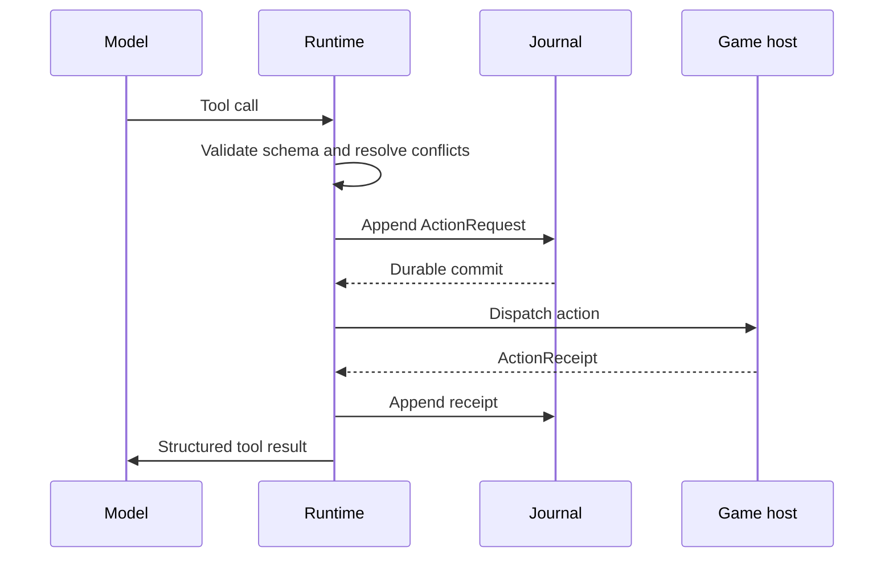

# Architecture

Game Agent Runtime separates reusable agent mechanics from engine integration
and game-specific rules.

## Layers

### Game layer

The game owns world state, permissions, simulation rules, action legality, and
the final mutation. It exposes typed observations and action handlers. A handler
returns an authoritative `ActionReceipt` with one of:

- `succeeded`
- `rejected`
- `failed`
- `unknown`

The runtime never invents a successful world mutation.

### Engine host

The host translates engine data to the wire protocol, runs handlers on the
required thread, pumps runtime events without blocking frames, and coordinates
scene/application shutdown. Godot and Unity hosts share the C# core but keep
engine types out of it.

### Runtime core

The core owns:

- run and turn lifecycle;
- normalized provider messages;
- provider retries and stale-stream fences;
- tool and skill snapshots;
- context compilation plus memory interfaces and a bounded local store;
- tool scheduling;
- budgets and bounded queues;
- control commands;
- journaling, operation ledgers, and recovery.

The core targets `netstandard2.1` and does not reference an engine SDK.

## Workload admission

The core has a final in-process workload boundary even when it is used without
an engine adapter. Limits belong to a registry or runtime instance; applications
that create multiple runtimes can share a registry when they need one common
boundary. `RunOwnershipRegistry` defaults to at most 256 admitted runs, 256 live
ownership lanes, and 64 queued waiters per lane. Waiting runs count toward the
active-run limit. Admission checks are atomic: an already active run ID reports
`duplicate_run`, while workload exhaustion uses the separate `max_active_runs`,
`max_lanes`, or `max_waiters_per_lane` reason code.

`GetDiagnostics()` returns only active, waiting, and lane counts plus immutable
limits. It never returns run or lane identifiers. The lane semaphore provides
mutual exclusion, but the API does not promise FIFO scheduling or starvation
freedom.

Engine adapters should normally configure lower limits that match their frame,
memory, and platform budgets. Those adapter limits protect the engine-facing
queue; the core limits remain a last line of defense for direct use and
misconfigured hosts. The compact `HeadlessAgentRuntime` independently defaults
to 256 concurrent runs and accepts a lower `HeadlessAgentRuntimeLimits` value.

## Durable action boundary

If dispatch may have happened but no authoritative receipt is available, the
runtime records `unknown` and enters `reconciling`. Recovery queries the game by
`operationId`; it does not replay the action.

Every durable store implements `AppendAtomicBatchAsync`. A set of model tool
calls is committed as one batch before any action is admitted to the host, and
receipt/lifecycle pairs use the same primitive. Custom stores must make the
whole batch visible or none of it; wrappers must forward this capability rather
than decomposing it into individual appends.

Run initialization uses the same atomic primitive. `run.started`, the optional
initial context/active-skill input snapshot, every initial transcript message,
and the first `run.checkpoint` enter the journal as one ordered batch. The input
snapshot is a recovery bridge only until the first turn snapshot commits; it
prevents a process loss between run initialization and turn preparation from
silently dropping required input. Recovery therefore sees either the complete
initial input in `running` state or no new run. A legacy or non-conforming
journal left in `preparing` is failed closed because recovery cannot infer which
initial messages are missing.

Each pre-provider turn boundary is atomic too. `turn.started`, any replacement
skill disclosure, compiled context message, deferred-tool activation change,
and `turn.snapshot` commit as one ordered batch. No conforming store can expose
a started turn while hiding the prompt inputs or tool state needed to retry it.

A successful model `runtime_tool_activate` result and its complete exact
activation state use a separate two-event atomic batch. Recovery therefore sees
both or neither. The activation changes only the next provider turn; every game
tool call in the response that requested activation is checked against the
fixed effective schema captured before that provider call.

If a process stops after `turn.started` but before a usable provider result, the
runtime reopens the turn only with journal proof that replay is safe: either no
provider dispatch exists for that turn, or every dispatch ended in an explicit
known-zero checkpoint. It writes a `turn.completed` abandonment checkpoint,
clears `currentTurnId`, refunds that turn count, and then starts a fresh turn.
The abandonment reason also makes a second crash idempotent. Charged,
uncertain, committed, or discarded provider attempts are never refunded by this
path. Prompt inputs already committed for the safe turn remain durable: selected
context is retained in the transcript, and activated skill references are
recovered from the durable disclosure when the continuation does not override
them. Only assistant/tool output from an abandoned turn is treated as orphaned.
The same disclosure inheritance applies at a clean turn boundary. A continuation
with a non-empty `ActiveSkills` collection replaces the recovered activation.
To deliberately clear all active skills, the caller supplies an empty collection
with `ReplaceActiveSkills = true`.

## Turn snapshots

Each turn captures one immutable tool snapshot and one immutable skill snapshot.
Hot updates become visible on the next turn. A durable `TurnSnapshot` records
generations and digests so a trace can explain exactly what the model saw.
Skill admission is evaluated against those captured snapshots before prompt
disclosure. The snapshot extension records the admission policy identity,
version, decision-set digest, and admitted active-skill content digests. It
also records the complete context budget report and prompt byte/token estimate,
including turns where every optional context item was deferred or pruned.
The tool-disclosure extension separately identifies base direct tools, exact
active deferred tools, runtime control tools, the effective provider-schema
digest, the current authorized-hidden-only digest, and policy decision/reason
digests. Internal and denied descriptors do not contribute to the hidden
catalog digest.
The runtime also deep-snapshots each admitted run request or continuation before
its first asynchronous wait, so caller-owned mutable DTOs cannot change a queued
run's identity, budget, transcript, context, or active skills.

## Provider attempts and usage

A provider attempt can be retried only when its cleanup completed and either the
provider proved that no usage occurred or a usage event was durably charged.
Before provider code can dispatch a request, the runtime appends a durable
`provider.dispatch_started` checkpoint containing the provider, provider-attempt,
and stream-attempt identities. Reported usage settles billing for that identity,
while the response remains open until an atomic assistant-transcript plus
`provider.result_committed` batch succeeds or a
`provider.result_discarded` checkpoint records that the response will not be
used. Explicit known-zero and uncertain-usage records also close a dispatch.
Recovery treats a dispatch with unknown usage as a billing failure and a billed
dispatch with no durable response result as a response-recovery failure. Neither
path starts another provider request.

After a response has been obtained, the runtime performs one final
control/deadline check and then durably adopts or discards that response with a
non-cancellable settlement. If response completion races with steer, interrupt,
cancel, or the deadline, charged usage is recorded first and a matching
`provider.result_discarded` event closes the same provider/attempt/stream
identity before the control outcome is applied.

Usage from failed attempts counts toward the same run budget, and later attempt
output caps shrink by the tokens already consumed. If a dispatched attempt ends
without a trustworthy usage event, the runtime does not retry or fall back
silently. It sets `AgentUsage.hasUnaccountedUsage`, increments
`unaccountedProviderAttempts`, and appends a durable
`provider.usage_uncertain` checkpoint. The known token and cost totals remain
lower bounds until application billing data reconciles the missing attempt. The
event carries the provider, provider-attempt, stream-attempt, and reason
identifiers as structured fields. Recovery never starts another provider request
from a non-terminal run with unaccounted usage: it first fails the run closed, or
waits for pending game-operation reconciliation and then fails it closed. The
application must reconcile billing separately and start a new run.

## Local and remote responsibilities

The runtime, journal, context compiler, scheduler, and engine host run locally.
The model provider is replaceable and may be local or remote. Cloud services are
optional for the open-source runtime, but are appropriate for credential
protection, quotas, moderation, billing, fleet telemetry, and hosted memory.
